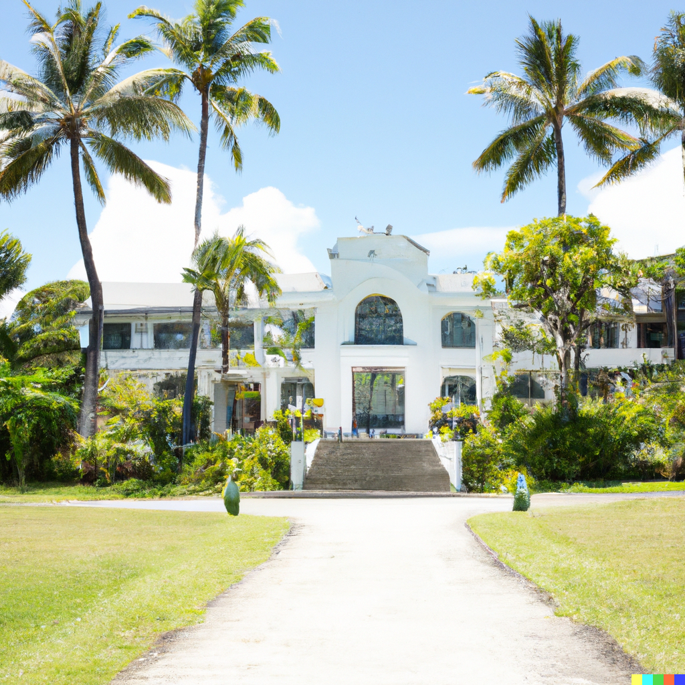

## Explore the Natural Beauty of Taniti

Taniti is known for its natural beauty, which attracts thousands of tourists every year. There are several activities to enjoy the outdoors and the natural surroundings, including:

- Visiting the beaches,
- Exploring the rainforest,
- Visiting the volcano {:class="img-right"}

## Other Fun Activities

Apart from exploring the natural beauty of Taniti, there are several other activities to do. Here are some options:

Visiting a local history museum {:class="img-right"}

- Going on chartered fishing tours,
- Snorkeling,
- Zip-lining in the rainforest,
- Visiting several pubs, including a microbrewery,
- Dancing at a new dance club,
- Seeing a movie,
- Taking helicopter rides,
- Playing at an arcade,
- Visiting art galleries,
- Bowling

Also, a nine-hole golf course should be operational by next year. Many of these activities are located in Merriton Landing, which is a rapidly developing area on the north side of Yellow Leaf Bay.

{:class="img"}
